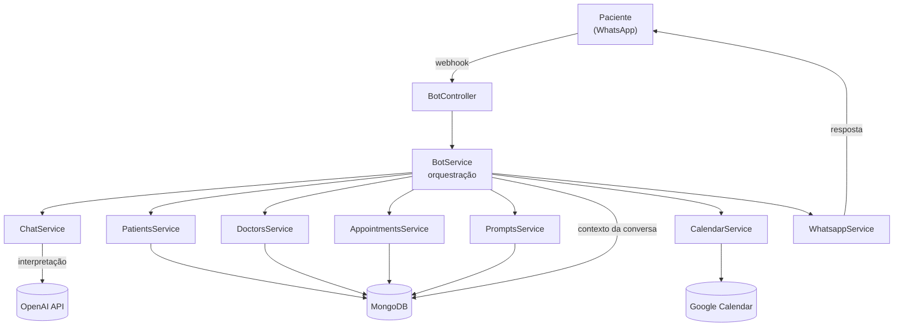

# Secretária Virtual

Assistente de agendamento por WhatsApp para uma clínica de obstetrícia e fertilidade. A paciente conversa em linguagem natural — "quero marcar pré-natal com a Dra. Camila, de preferência numa terça de manhã" — e o sistema interpreta a intenção, cruza a agenda das médicas, sugere horários, confirma e cria o evento no Google Calendar.

Construído em NestJS + TypeScript, com contexto de conversa persistido e integração com a agenda real da clínica.

> **Status:** funcional ponta a ponta, não colocado em produção. A clínica optou por não seguir adiante.

---

## O problema

A recepção da clínica gastava boa parte do dia respondendo as mesmas mensagens no WhatsApp: qual médica atende tal procedimento, quais horários existem, remarcar, cancelar. O volume era alto e repetitivo, mas cada conversa era diferente o bastante para não caber em um menu de opções numeradas — a paciente escreve como fala.

O objetivo foi absorver o agendamento de rotina em linguagem natural, escalando para uma pessoa sempre que a conversa saísse do escopo administrativo.

## Arquitetura



### Módulos

| Módulo | Responsabilidade |
|---|---|
| `bot` | Orquestração da conversa, máquina de estado do agendamento, motor de disponibilidade |
| `ai` | Interpretação da mensagem e geração das respostas em linguagem natural |
| `prompts` | Prompts versionados em banco, editáveis sem deploy |
| `patients` | Cadastro de pacientes, identificadas pelo telefone |
| `doctors` | Médicas, procedimentos que cada uma atende e grade de horários |
| `appointments` | Agendamentos criados, com vínculo ao evento do Calendar |
| `calendar` | Criação, atualização e cancelamento de eventos no Google Calendar |
| `whatsapp` | Envio de mensagens através do gateway |

## Como funciona uma conversa

1. **Webhook** recebe a mensagem e identifica a paciente pelo telefone.
2. **Interpretação** — o `ChatService` extrai da mensagem: tipo de consulta, médica preferida, formato (online ou presencial), dias preferidos, horário escolhido, e sinais de cancelamento, remarcação ou necessidade de atendimento humano.
3. **Contexto acumulado** — o resultado é mesclado ao `ChatContext` da paciente, persistido em MongoDB. A conversa é multi-turno de verdade: a paciente pode dar uma informação por mensagem, mudar de ideia no meio, ou voltar duas horas depois.
4. **Decisão** — com tipo de consulta, médica e formato definidos, o motor de disponibilidade cruza a grade de cada médica com os dias preferidos e devolve sugestões reais de horário.
5. **Confirmação** — escolhido o horário, o sistema revalida a disponibilidade (a agenda pode ter mudado), cria o evento no Google Calendar e grava o agendamento.
6. **Resposta** — a mensagem final passa por uma segunda chamada ao modelo, responsável só por escrever com o tom da clínica.

## Decisões técnicas

**Duas chamadas ao modelo, com papéis separados.** Uma interpreta e devolve estrutura; outra escreve a resposta em linguagem natural. Misturar as duas coisas em um único prompt degradava as duas: ou o JSON vinha malformado, ou a resposta ficava robótica. Separar também deixa a interpretação barata e determinística (`temperature: 0.2`) e a escrita mais solta (`0.4`).

**Contexto em banco, não em memória.** Conversa de WhatsApp não tem sessão. A paciente some por duas horas e volta no meio do assunto. O `ChatContext` é um documento por paciente, com `timestamps`, e o sistema usa a inatividade para decidir se recomeça ou continua de onde parou.

**Prompts como dado, não como código.** O módulo `prompts` guarda os textos em banco. Ajustar o tom da clínica não exige deploy.

**Guardrails de escopo clínico.** O assistente nunca opina sobre saúde. Qualquer mensagem que peça orientação médica marca `requerIntervencaoHumana` e a conversa vai para uma pessoa.

**Revalidação antes de confirmar.** Entre sugerir um horário e a paciente confirmar podem passar minutos. O sistema checa de novo a disponibilidade antes de criar o evento, e trata o horário no passado como inválido.

## Stack

- **NestJS 11** · TypeScript · Express
- **MongoDB** com Mongoose
- **OpenAI API**
- **Google Calendar API** via service account
- **Gateway de WhatsApp** de terceiros (não é a API oficial da Meta)
- **Firebase Functions** para deploy · Docker Compose para desenvolvimento
- **Swagger** para documentação da API administrativa

## Rodando localmente

```bash
cd functions
npm install
cp .env.example .env    # preencha as variáveis
npm run start:dev
```

As credenciais do Google Calendar ficam em `functions/credentials/google-calendar-key.json` (fora do versionamento). A API administrativa é protegida por header `x-api-key`.

### Variáveis de ambiente

| Variável | Descrição |
|---|---|
| `MONGO_URL` | String de conexão do MongoDB |
| `OPENAI_API_KEY` | Chave da API da OpenAI |
| `OPENAI_MODEL` | Modelo usado na interpretação |
| `WAPI_INSTANCE_ID` | Identificador da instância no gateway de WhatsApp |
| `WAPI_TOKEN` | Token do gateway |
| `API_KEY` | Chave da API administrativa |

## Limitações conhecidas

Trabalho em andamento, listado aqui de propósito:

- **A interpretação usa structured output por prompt**, não tool calling. Funciona, mas a validação é um `JSON.parse` com fallback — migrar para tool calling com schema validado é a próxima mudança.
- **Sem suite de testes.** A lógica de disponibilidade é pura e perfeitamente testável; só não foi testada.
- **Sem evals.** Não há medição sistemática de acerto de interpretação sobre um conjunto de conversas reais.
- **Sem observabilidade.** Custo em tokens e latência por conversa não são registrados.
- **O webhook é público e sem verificação de assinatura** — aceita qualquer POST.
- **`bot.service.ts` concentra demais.** Orquestração, regra de negócio e cálculo de agenda no mesmo arquivo.

## Licença

Projeto pessoal, sem licença de uso definida.
